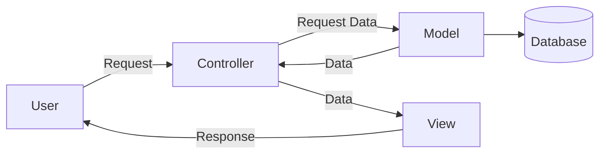

# Mastering Go

## Code Organization on Gin Framework

O Gin Framework em Go oferece liberdade na organização do código, não impondo uma estrutura obrigatória. É comum adotar a arquitetura MVC (Model-View-Controller) para manter a organização clara e a responsabilidade de cada componente bem definida.



Uma estrutura típica de pastas no Gin Framework pode ser a seguinte:

```shell
│   ├── controllers
│   ├── helpers
│   ├── middlewares
│   ├── models
│   ├── static
│   ├── templates
│   ├── go.mod
│   ├── main.go
│   └── README.md
``` 
## GORM Hooks

Hooks em GORM permitem realizar operações específicas antes ou depois de certos eventos no ciclo de vida de um modelo. Um exemplo é a validação de dados antes de inseri-los no banco de dados.

``` go
func (user *User) BeforeCreate(tx *gorm.DB) error {
    fmt.Println("Before!")
    if user.Name == "" {
        return errors.New("Name cannot be blank")
    }
    return nil
}
``` 
## Decorator Pattern [here](Decorator%20Pattern/)
